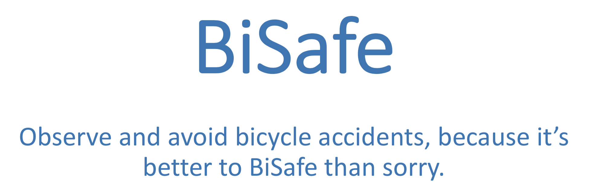
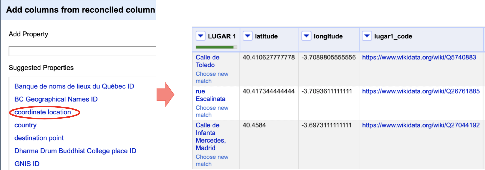
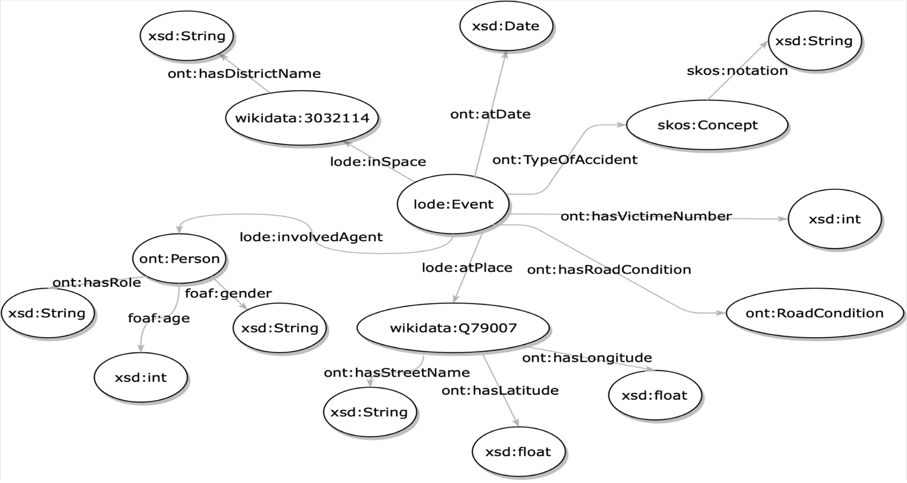
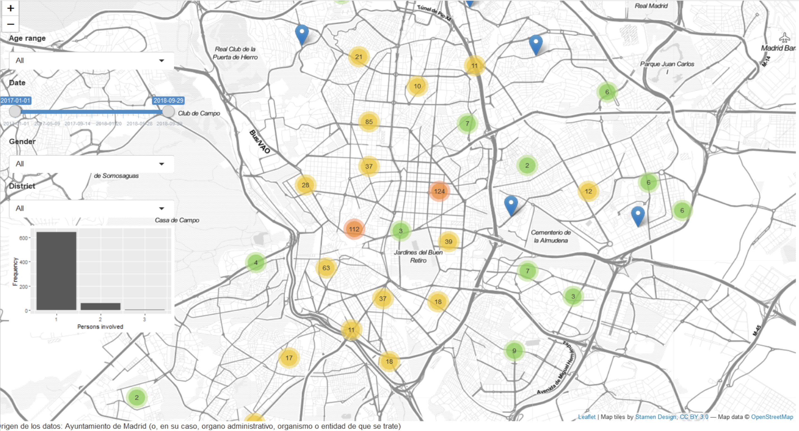

# BiSafe

R Project for visualisation of bicycle accidents. Contains open data from [Portal de datos abiertos del Ayuntamiento de Madrid](https://datos.madrid.es/portal/site/egob/menuitem.c05c1f754a33a9fbe4b2e4b284f1a5a0/?vgnextoid=20f4a87ebb65b510VgnVCM1000001d4a900aRCRD&vgnextchannel=374512b9ace9f310VgnVCM100000171f5a0aRCRD&vgnextfmt=default) and the ontologies created for it.

## Reconciliation and data augmentation

The dataset has been reconciling using the tool provided by RDF extention in [OpenRefine](http://openrefine.org). It look for entities in [WikiData](https://www.wikidata.org/wiki/Wikidata:Main_Page) that matches the rows of our dataset. Once the streets in our dataset have been linked to the objects they refer to by URI, it is possible to extract additional informations, like, as in our case, the latitude and longitude.

## Ontology definition

Once our dataset in csv format looks complete, we need to define the RDF schema that will represent our records.\
For the vocabulary, we tried to use already defined prefixes and classes. We took some definitions from common vocabularies like:

* `foaf`
* `lode`
* `wikidata`
* `skos`

## GUI

Obtained the dataset in RDF turtle-like format (.ttl), we now need to query it from the R programming language, with the help of the library `rdflib`.

It is possible to zoom in for expand the spots and better locate the accidents. On the left, some filters are provided. You can filter for specific values of `Age`, `Date`, `Gender` of the biker, and for `District` in which the accident took place.

Try [BiSafe](https://nrigheriu.shinyapps.io/BiSafe/) now!
